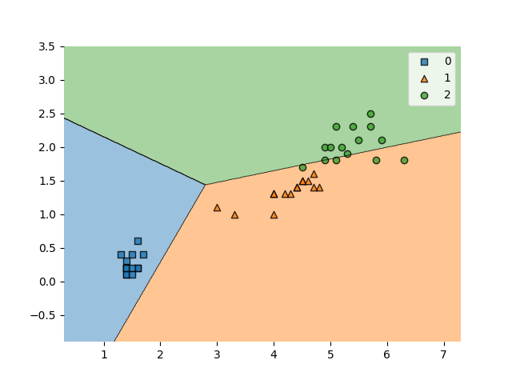
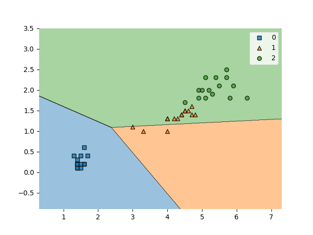

# Wniosek

Na podanym zbiorze danych testowych implementacja regresji logistycznej osiągnęła dokładność **0,89**, a implementacja perceptronu dokładność **0,73**.
Oznacza to, że regresja logistyczna jest lepszym modelem do klasyfikacji tego zbioru danych.

## Wynik

Perceptron

Regresja logistyczna

