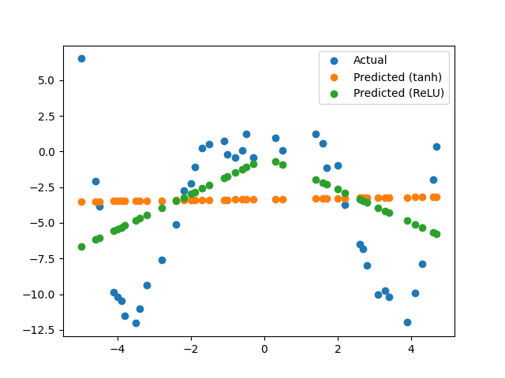
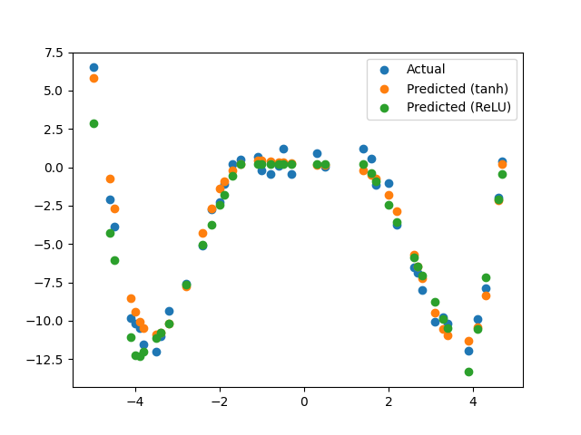

# Wniosek

Sieć w przypadku domyślnym ustawień nie jest optymalnie wytrenowana.
By uzyskać lepsze wyniki należy zwiększyć liczbę epok, a także zwiększyć liczbę neuronów w warstwie ukrytej (drugie zdjęcie).

## Wynik

