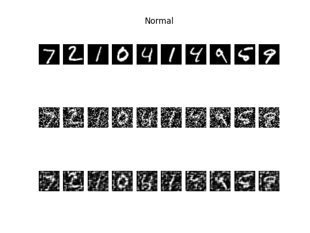
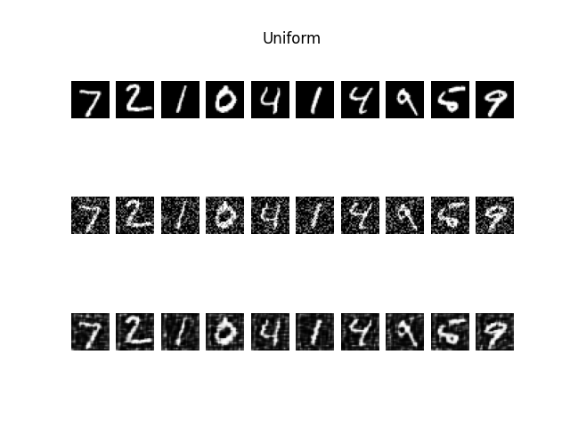
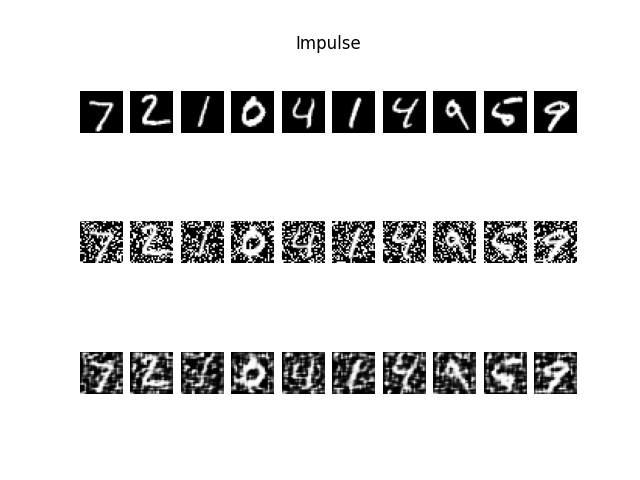
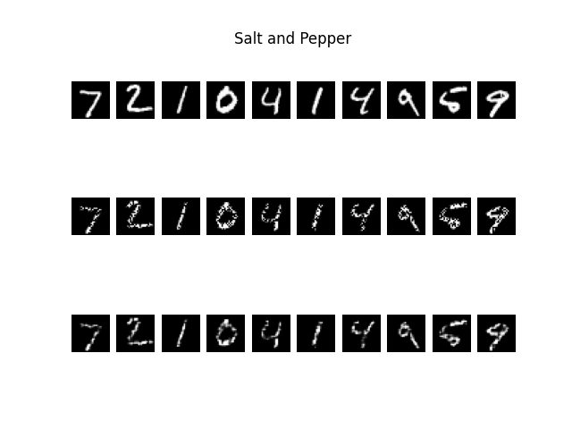

# Wniosek

Wszystkie próby zostały przeprowadzone na **30** epokach ze współczynnikiem zaszumienia wynoszącym **0,7**.
Najlepiej odwzorowane zostały zdjęcia zaszumione jednorodnie (uniform). 
Najgorzej natomiast te zaszumione szumem Gaussa.

## Wynik

