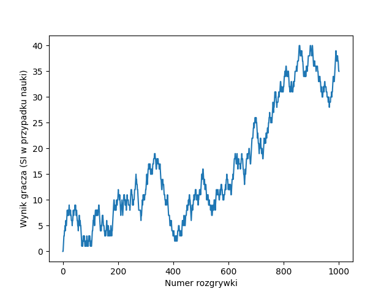

Wykres przedstawiający ilość punktów SI po treningu na próbie 1000 pseudolosowych rozgrywek.

Wykres przedstawiający ilość punktów gracza po 50 schematycznych rozgrywkach z SI, bez wcześniejszego treningu.

